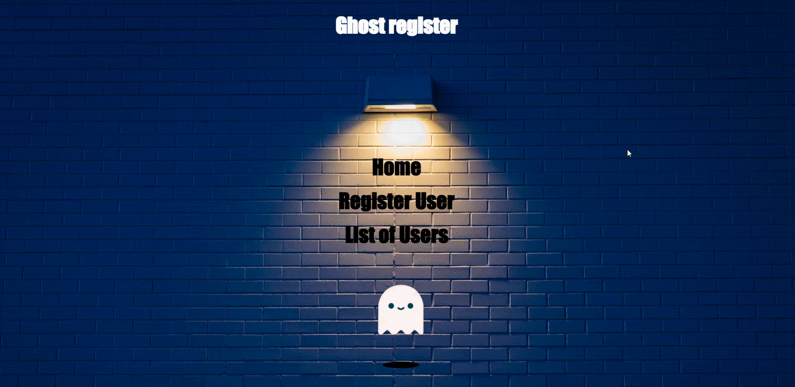
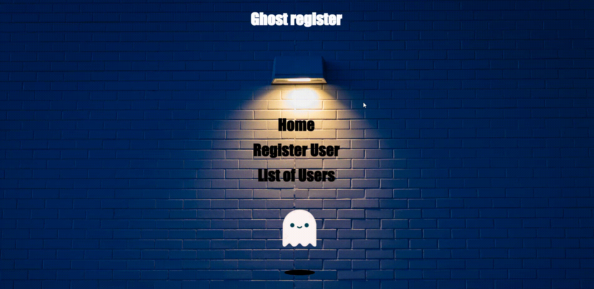
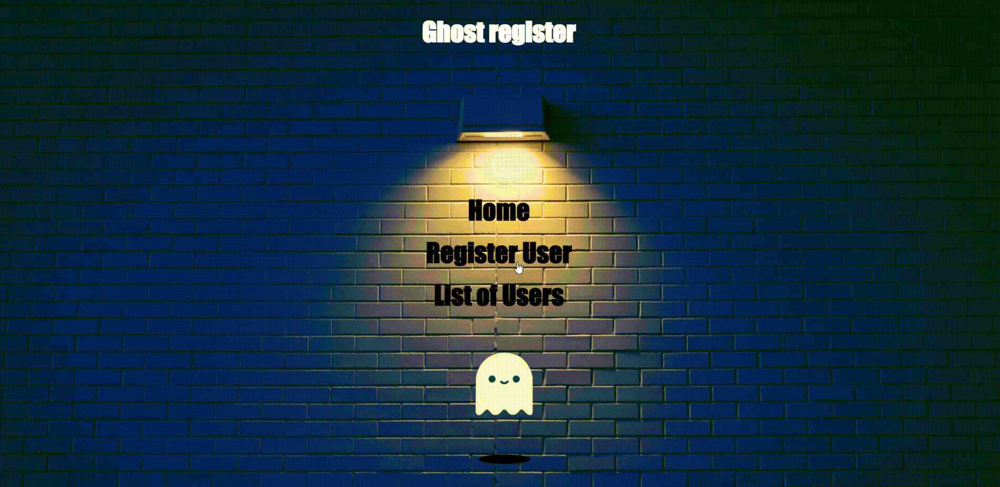

# GHOST REGISTER MONGODB

## 💻 About the project

💻 Ghost Register - Using NodeJS and mongoDB as the project's MVC (Model, View, Controller) structure for a simple user registration, and the rendering of the pages made with EJS. The project makes the famous CRUD (Create, Read, Update, Delete).

---

## ⚙️ Features

- ## [x] Home

    <br>
    <h1 align="center">
        
    </h1>
    <br>

- ## [x] Register new user

    <br>
    <h1 align="center">
        
    </h1>
    <br>

- ## [x] Edit user

    <br>
    <h1 align="center">
        
    </h1>
    <br>

- ## [x] Delete user

    <br>
    <h1 align="center">
        
    </h1>
    <br>

---

## Ghost Register using Nodejs, Expressjs, MongoDB, EJS, Ready-to-use MVC Project Structure

A ready-to-use boilerplate for MVC Development with EJS, Node.js, Express, and MongoDB

## Getting started

This is a basic MVC skeleton written in JavaScript ES2015. Very useful to building a MVC web.

This project will run on **NodeJs** using **MongoDB** as database, **EJS** as pages. I had tried to maintain the code structure easy as any beginner can also adopt the flow and start building an MVC. Project is open for suggestions, Bug reports and pull requests.

## Software Requirements

- Node.js **16.13.1**
- MongoDB **3.6+** (Recommended **4+**)
- NPM **8.3.0**

## How to install packages with **NPM**

- npm init (start npm on project after install node and npm);
- npm install mongoose ejs bcrypt express (install dependencies for the project with just one command);
- npm install --save-dev nodemon (install nodemon for restart application only in dev dependencies).

### Running server locally

1. After install all dependencies open the file 'package.json'

- Change the scripts like this

```json
"scripts": {
    "dev": "nodemon src/server.js", // put this line
    "test": "echo \"Error: no test specified\" && exit 1"
  },
```

- Now you can run the project

```bash
npm run dev
```

- If is evertything ok, do you received message like this

```bash
> ghost-register-mongodb@1.0.0 dev
> nodemon src/server.js

[nodemon] 2.0.15
[nodemon] to restart at any time, enter `rs`
[nodemon] watching path(s): *.*
[nodemon] watching extensions: js,mjs,json
[nodemon] starting `node src/server.js`
Server listening on port 5500
Connected to database!

Press CTRL + C to stop the process.
```

## MongoDB

- Here you put your configuration to connect locally, i use the mongoDB compass and create my connection with name "projeto-mongodb", do you can put other name you like on your database e change on the string like "mongoose.connect('mongodb://localhost:27017/your-database-name?readPreference=primary&appname=MongoDB%20Compass&directConnection=true&ssl=false')".

```js
mongoose.connect('mongodb://localhost:27017/projeto-mongodb?readPreference=primary&appname=MongoDB%20Compass&directConnection=true&ssl=false')
```

## Project structure

```sh
.
├── package-lock.json
├── package.json
├── .gitignore
├── README.md
├── node_modules
└── src
    ├── controllers
    │   ├── customers.js
    │   └── index.js
    ├── database
    │   └── index.js
    ├── models
    │   └── customers.js
    ├── public
    │   ├── css
    │   │   └── style.css
    │   ├── files
    │   │   ├── delete.gif
    │   │   ├── edit.gif
    │   │   ├── home.gif
    │   │   └── register.gif
    │   ├── img
    │   │   ├── background.jpg
    │   │   └── wall.jpg
    │   └── js
    │       └── main.js
    ├── routes
    │   └── index.js
    ├── utils
    │   └──  password.js
    └── views
        ├── partials
        │   ├── foot.ejs
        │   ├── ghost.ejs
        │   ├── head.ejs
        │   └── navbar.ejs
        ├──  edit.ejs
        ├── index.ejs
        ├── list.ejs
        ├── register.ejs
        └── server.js
```

## Creating new models

- If you need to add more models to the project just create a new file in `/models/` and use them in the controllers.

## Creating new routes

- If you need to add more routes to the project just create a new file in `/routes/` and add it in `/routes/index.js` it will be loaded dynamically.

## Creating new controllers

- If you need to add more controllers to the project just create a new file in `/controllers/` and use them in the routes.

## Bugs or improvements

- Every project needs improvements, Feel free to report any bugs or improvements. Pull requests are always welcome.

## 🛠 Technologies

### The following tool was used in building the project:

- **[EJS](https://ejs.co/)**
- **[CSS](https://developer.mozilla.org/docs/Web/CSS)**
- **[JavaScript](https://www.javascript.com/)**
- **[NodeJS](https://nodejs.org/en/)**
- **[NPM](https://www.npmjs.com/)**
- **[MongoDB](https://www.mongodb.com/products/compass)**

## Author

 
 <br />
 <sub><b>Henrique M. Kronhardt</b></sub></a>
 <br />

[](https://www.linkedin.com/in/henriquekronhardt/)

---

Made with ❤️ by Henrique M. Kronhardt 👋🏽 [Get in touch!](https://www.linkedin.com/in/henriquekronhardt/)
